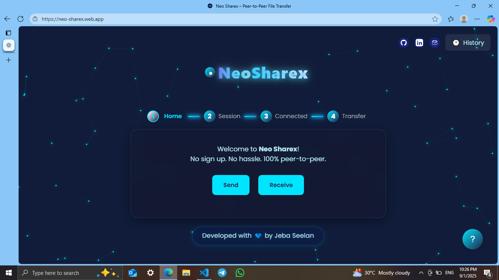

# Neo Sharex

> Blazing-fast, privacy-first P2P file transfer for all devices.

[](LICENSE)
[](https://neo-sharex.web.app)
[](https://react.dev/)
[](https://vitejs.dev/)
[](https://firebase.google.com/)
[](https://www.framer.com/motion/)
[](CONTRIBUTING.md)
[](https://github.com/Px-JebaSeelan/Neo-Sharex/actions)

> Instantly transfer files between devices, peer-to-peer, with no sign-up. [Try it live!](https://neo-sharex.web.app)

---

## Table of Contents
- [Overview](#overview)
- [Features](#features)
- [Demo & Screenshot](#demo--screenshot)
- [Use Cases](#use-cases)
- [Quick Start](#quick-start)
- [Prerequisites](#prerequisites)
- [How It Works](#how-it-works)
- [Customization](#customization)
- [Firebase Configuration](#firebase-configuration)
- [Project Structure](#project-structure)
- [Architecture Overview](#architecture-overview)
- [Performance & Optimization](#performance--optimization)
- [Security](#security)
- [Accessibility](#accessibility)
- [Troubleshooting & FAQ](#troubleshooting--faq)
- [Contributing](#contributing)
- [Support](#support)
- [License](#license)
- [Acknowledgements](#acknowledgements)
- [Built With](#built-with)
- [Roadmap](#roadmap)

---
## Overview

Neo Sharex is a cutting-edge, privacy-focused peer-to-peer (P2P) file transfer platform designed for seamless sharing across all devices. Built with modern web technologies, it enables users to transfer files instantly and securely, without the need for registration or cloud storage. Neo Sharex prioritizes user privacy, speed, and accessibility, making it an ideal solution for individuals and teams who value secure, direct file exchange. Whether for personal use or collaborative work, Neo Sharex delivers a robust and intuitive experience, ensuring your data remains private and your transfers are effortless.

---

## Features
- **Instant, peer-to-peer file transfer** (mobile & desktop)
- **No sign-up required**
- **QR code pairing** for seamless device connection
- **Multi-file transfer** with drag-to-reorder queue
- **Pause, resume, and cancel** for uploads/downloads (resumable transfers)
- **Transfer history** (local, private, export/import)
- **File preview** for images, video, audio, PDF, markdown, CSV, ZIP, DOCX, PPTX, XLSX, and code/text files
- **Copy download link** for received files
- **Accessibility**: ARIA roles, keyboard navigation, focus styles
- **Theme switching** with live previews (dark, light, custom)
- **Subtle UI animations** (tooltips, progress, panels)
- **Mobile-first, responsive design** with glassmorphism and animated branding
- **Performance optimizations** (React.memo, useCallback, lazy loading)
- **Robust error handling and user feedback**
- **Automatic session cleanup:** Session data is deleted from Firestore when a session ends, keeping the database efficient and private.
- **Maximum transfer speed:** Uses large chunk sizes, zero backend delay, and WebRTC DataChannel flow control for the fastest possible file transfer without corruption.
- **Modern mobile UI:** Progress bars, file cards, and scrollbars are fully responsive and visually optimized for all devices.
- **Open source** and privacy-focused (no files or user data stored on any server)

---

## Demo & Screenshot



---

## Use Cases
- Send photos from your phone to your laptop instantly
- Share documents in a meeting without email or cloud
- Transfer videos between friends securely
- Move files between work and home computers
- Share code snippets or PDFs in a study group

---

## Quick Start

### Prerequisites
- Node.js (v18+ recommended)
- npm or yarn
- Modern browser (Chrome, Edge, Firefox, Safari)

1. **Clone the repository:**
   ```sh
   git clone https://github.com/Px-JebaSeelan/Neo-Sharex.git
   cd Neo-Sharex
   ```
2. **Install dependencies:**
   ```sh
   npm install
   
yarn install
   ```
3. **Configure Firebase:**
   - Create a Firebase project at [console.firebase.google.com](https://console.firebase.google.com/)
   - Enable **Firestore** (for signaling)
   - Run:
     ```sh
     npm run setup-env
     ```
   - This will create a `.env` file from `.env.example` if it doesn't exist. Fill in your Firebase config values in `.env`.
   - The `.env` file is already in `.gitignore` and will not be committed.
   - The app loads Firebase config from environment variables for security and flexibility.
4. **Start the development server:**
   ```sh
   npm run dev
   
yarn dev
   ```
5. **Open in browser:**
   Visit [http://localhost:5173](http://localhost:5173)

---

## How It Works
1. Sender creates a session and gets a QR code or session code
2. Receiver scans the QR code or enters the code
3. Devices connect via Firebase for signaling
4. WebRTC DataChannel is established for direct, encrypted file transfer
5. Files are sent peer-to-peer, never stored on any server

---

## Customization
- **Chunk size:** Edit `src/App.jsx` to adjust the `CHUNK_SIZE` constant for transfer speed vs. memory usage
- **Max file size:** Change the `MAX_FILE_SIZE_MB` constant in `src/App.jsx`
- **Themes:** Modify or add themes in the CSS or via the theme switcher in the UI
- **Branding:** Replace `public/logo.svg` and update `index.html` for custom branding

---

## Firebase Configuration

**Important:** Do NOT commit your real Firebase credentials.

- The `.env` file is used for Firebase config and is ignored by git.
- See `src/firebase.js` for the config template.

---

## Project Structure

```
neo-sharex/
├── public/
│   └── logo.svg
├── src/
│   ├── App.jsx
│   ├── App.css
│   ├── index.css
│   ├── main.jsx
│   ├── firebase.js
│   └── components/
│       ├── ChidoriEffect.jsx
│       ├── ConstellationBackground.jsx
│       ├── Fab.jsx
│       ├── FileDropzone.jsx
│       ├── FileDropzone.css
│       ├── FilePreview.jsx
│       ├── Modal.jsx
│       ├── Notification.jsx
│       ├── PauseResumeCancel.jsx
│       ├── Stepper.jsx
│       ├── Tooltip.jsx
│       ├── TransferHistory.jsx
│       └── TransferProgress.jsx
├── __tests__/
│   └── transferProgress.test.js
├── cypress/
│   └── e2e/
│       └── file_transfer.cy.js
├── scripts/
│   └── setup-env.js
├── docs/
│   ├── ARCHITECTURE.md
│   └── screenshot-main.png
├── package.json
├── vite.config.js
├── firebase.json
├── README.md
├── CHANGELOG.md
├── CONTRIBUTING.md
├── CODE_OF_CONDUCT.md
├── LICENSE
└── index.html
```

---

## Architecture Overview

```
+-------------------+        +-------------------+        +-------------------+
|   Sender Device   | <----> |   Firebase (DB)   | <----> |  Receiver Device  |
|  (React + WebRTC) |        |  (Signaling only) |        | (React + WebRTC)  |
+-------------------+        +-------------------+        +-------------------+
      |                        |                        |
      |<------ WebRTC Peer-to-Peer Data Channel ------->|
      |                        |                        |
      |<--- QR/Session Code ---|--- QR/Session Code --->|
```
- **Frontend:** React 19, Vite, Framer Motion, modern CSS
- **Signaling:** Firebase Firestore (for session/ICE exchange only; session data is deleted after use)
- **Transfer:** WebRTC DataChannel (end-to-end, direct, encrypted, with flow control)
- **No files or user data stored on any server**

---

## Performance & Optimization
- **Maximum transfer speed:** Large chunk sizes (up to 128KB), no backend delay, and WebRTC DataChannel flow control for optimal throughput and stability.
- **Automatic session cleanup:** Session data is deleted from Firestore when a session ends.
- Major UI components use `React.memo` for fast rendering
- File preview (PDF, markdown, ZIP, CSV, DOCX, PPTX, XLSX, etc.) is lazy-loaded for minimal bundle size
- Async actions show clear loading/error states for robust UX
- Handles large file lists and multi-file transfers efficiently
- Minimal re-renders and optimized event handlers with `useCallback`
- Drag-to-reorder file queue for flexible sending order
- Mobile-first layout and touch optimizations

---

## Security
- **No files or user data stored on any server:** All file transfers are direct, peer-to-peer, and end-to-end encrypted using WebRTC. Only session metadata and signaling info are temporarily stored in Firebase and deleted after use.
- **Transfer history is local and private** (export/import supported)
- **Open source:** All code is public and auditable.
- **Session data is deleted after use** for privacy and efficiency.

---

## Accessibility
- All interactive elements have ARIA roles and keyboard navigation
- Focus styles are visible and accessible
- UI tested with screen readers and high-contrast modes
- Please report any accessibility issues via [GitHub Issues](https://github.com/Px-JebaSeelan/Neo-Sharex/issues)

---

## Troubleshooting & FAQ
- **Connection issues?**
  - Ensure both devices are on stable internet and not behind strict firewalls.
  - Use a modern browser (Chrome, Edge, Firefox, Safari).
  - If transfer fails, refresh and retry or use a different network.
- **Large files not sending?**
  - Max file size is 500MB per file (browser/WebRTC limitation).
  - Try splitting files if needed.
- **QR code not scanning?**
  - Increase screen brightness and ensure the code is fully visible.
- **Other issues?**
  - Check browser console for errors.
  - Open an issue on GitHub with details.

---

## Contributing

We welcome contributions! To get started:
1. Fork the repository
2. Create a new branch (`git checkout -b feature/your-feature`)
3. Make your changes (add tests/documentation where possible)
4. Commit and push (`git commit -m 'Add feature'`)
5. Open a Pull Request

Please follow the [Contributor Covenant](https://www.contributor-covenant.org/) code of conduct.

---

## Support
- For help, open an [issue](https://github.com/Px-JebaSeelan/Neo-Sharex/issues)
- For discussions, join the [GitHub Discussions](https://github.com/Px-JebaSeelan/Neo-Sharex/discussions)
- Contact the maintainer via GitHub profile
- Developer Email: packiyajebaseelan@gmail.com

---

## License

MIT License. See [LICENSE](LICENSE) for details.

---

## Acknowledgements
- [React](https://react.dev/)
- [Vite](https://vitejs.dev/)
- [Firebase](https://firebase.google.com/)
- [Framer Motion](https://www.framer.com/motion/)
- [qrcode.react](https://github.com/zpao/qrcode.react)

---

## Built With
- [React 19](https://react.dev/)
- [Vite 5](https://vitejs.dev/)
- [Firebase 9](https://firebase.google.com/)
- [Framer Motion 11](https://www.framer.com/motion/)
- [qrcode.react](https://github.com/zpao/qrcode.react)

---

## Roadmap
- Multi-language support
- Offline mode (PWA)
- Drag-and-drop file transfer between browser windows
- More file preview types
- Advanced transfer analytics
- Customizable themes and branding
- Native mobile app wrappers

---

> Made with ❤️ for seamless, private sharing.
# Neo-Sharex

